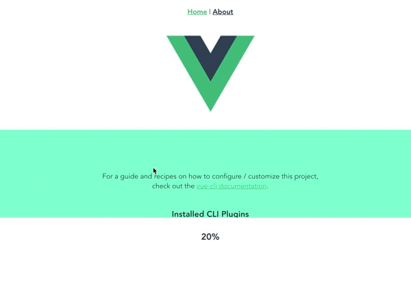

# eno-auto-scroll

自动循环滚动

## Plugin example


## Plugin install
```
npm install --save eno-auto-scroll
```

## Plugin setup
> src/main.js

```
import EnoAutoScroll from 'eno-auto-scroll';

Vue.use(EnoAutoScroll);
```

### Component usage
```
<EnoAutoScroll style="height: 100px;">
    <div>第1行</div>
    <div>第2行</div>
    <div>第3行</div>
    <div>第4行</div>
    <div>第...行</div>
</EnoAutoScroll>
```

### Component Props

| name | type | default | describe |
| --- | --- | --- | --- |
| duration | Number | 3000 | 经过scrollScope范围，过程时间(ms) |
| scroll-scope | Number, String | 'component' | 在duration时间内滚动的范围。('component':组件可视区域 , 'content':整个列表 , Number:指定(px)) |
| is-mouse-stop | Boolean | true | 鼠标划过是否暂停 |
| is-daemon | Boolean | false | 是否以守护程序方式继续后台运行。当页面隐藏的时候，不会滚动 |
| is-mousewheel-control | Boolean | true | 是否支持鼠标滑轮控制，必须开启[:isMouseStop]，这个操作的设置才有效 |
| is-scroll-from-bottom | Boolean | true | 是否从末尾开始滚动 |
| animate-duration | Number | 300 | 动画刷新时间间隔(ms) |
| orientation | String | 'vertical' |  滚动方向 ( 'vertical' , 'horizontal') |


### Component Event
| name | type | describe |
| --- | --- | --- |
| on-progress | Number | 进度改变值(0 - 100) |


### Component Ref function
```vue]
<EnoAutoScroll ref="enoAutoScroll" style="height: 100px;">
</EnoAutoScroll>
```
| name | params | default | describe |
| --- | --- | --- | --- |
| startScroll | - | - | 重新计算内容高度，并重新开始滚动 |
| stopScroll | - | - | 停止滚动，并且重置滚动位置 |
| keepScroll | - | - | 继续滚动 |
| pauseScroll | - | - | 暂停滚动 |
